# Coordinate Systems And Tooling Basics

This page explains the basic language used in CNC router and CNC mill documentation. It covers coordinate systems, axis directions, positive and negative values, and the most common shop terms used when planning or running a job.

## Why This Matters
Most CNC mistakes are not caused by one bad button press. They usually start with confusion about where zero is, which direction an axis moves, what a tool is actually doing, or how the part is being held. Understanding these basics makes every setup, CAM operation, and machine check easier to follow.

## Coordinate Systems
A coordinate system is a way of describing position. CNC machines use coordinates to tell the spindle where to move.

If someone says a tool is at `X = 2.000`, `Y = 4.000`, `Z = 0.250`, they are describing that tool's location relative to a chosen zero point.

Coordinates only mean something if everyone understands which zero point is being used.

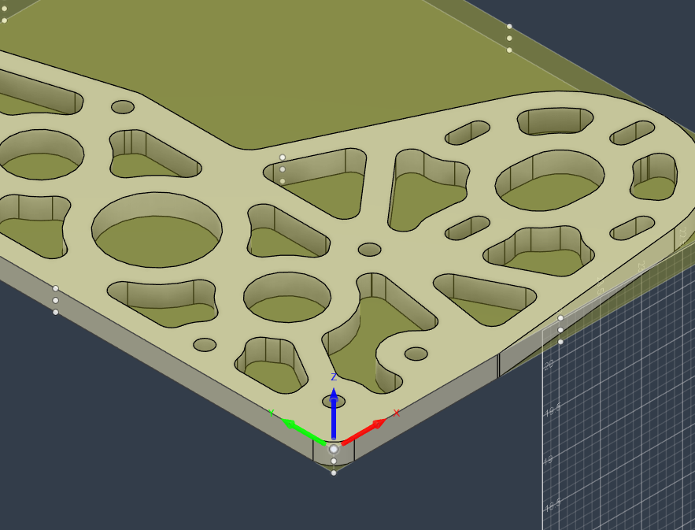

## The X, Y, And Z Axes
Both the router and the Tormach use three main linear axes:

- `X` is left/right
- `Y` is front/back
- `Z` is up/down

On both machines, `Z` is especially important because it controls tool height. A small mistake in `Z` can mean the cutter barely touches the part, cuts too deep, or crashes into the stock or table.

The exact machine motion can feel different depending on whether the table moves, the spindle moves, or both. What matters in CNC is the relative motion between the cutter and the work.

## Right-Hand Rule
The right-hand rule is a standard way to remember axis directions.

Hold out your right hand like this:

- Point your index finger in the positive `X` direction
- Point your middle finger in the positive `Y` direction
- Stick your thumb up in the positive `Z` direction

This is the standard axis convention used by CNC machines and CAD/CAM software. Even if the machine itself is physically arranged differently than expected, the coordinate system still follows this rule.

Why this matters:
Understanding the right-hand rule makes it much easier to catch flipped setups, mirrored parts, and incorrect work coordinate choices in Fusion 360 before running the machine.

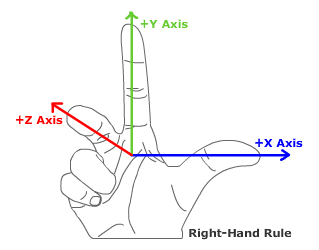

## Positive And Negative Values
Each axis has a positive direction and a negative direction.

Examples:

- Moving farther in the `+X` direction means the tool is moving in positive X
- Moving farther in the `-X` direction means the tool is moving in negative X
- Moving up is usually `+Z`
- Moving down into the material is usually `-Z`

This matters most when setting zero and checking CAM.

For example:

- If top of stock is `Z = 0`, then cutting into the material usually means using negative Z values
- If the origin is at the lower-left corner of a sheet, then features to the right and farther back will usually have larger positive X and Y values

Why this matters:
Many crashes and bad parts happen because a move is expected to go one way, but the machine goes the other way. Understanding positive and negative directions helps catch that before the tool touches the stock.

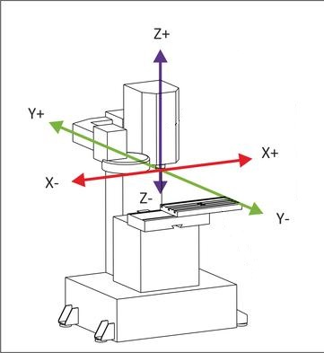

## Machine Zero Vs Work Zero
There is more than one "zero" in CNC.

### Machine Zero
Machine zero is the machine's own home reference. It is used by the controller to understand where the machine is in its total range of travel.

On the router and the Tormach, machine zero is not usually the same thing as the zero used to make a part.

### Work Zero
Work zero is the zero chosen for the current job. It is the point the program uses as the origin for machining the part.

Examples of work zero:

- A corner of the stock
- The center of a hole pattern
- The top face of the material
- A machined reference surface

Why this matters:
The machine can be homed correctly and still cut the part wrong if work zero is set incorrectly. A lot of day-to-day CNC setup work is really just making sure the machine's current work zero matches the CAM setup.

## Work Coordinates On The Router
On the router, there is not currently one permanent X/Y/Z work zero that every job uses.

Current router practice:

- `X` and `Y` are set manually at the best practical starting point for the current sheet or part
- `Z` is usually set from the top of stock
- Tool height is set using `Auto Z`

This means the router setup depends on choosing a work zero that is easy to set and easy to verify against the Fusion setup.

Why this matters:
Because the zero location can change from job to job, it is especially important to double-check that the chosen X/Y point and the expected Z reference match the posted program.

{width=70%}

## Work Coordinates On The Tormach
On the Tormach, work zero is also chosen based on the setup, but the setup is usually more constrained by the vise, fixture, or reference surfaces.

Common examples:

- A stock corner in the vise
- The top of the raw stock
- A finished reference face from an earlier operation
- The corner of a soft jaw or fixture

Why this matters:
Mill setups often depend on repeating the same location accurately over multiple operations. The chosen work zero needs to be easy to find again and stable enough to support the tolerance the part needs.

## What "Work" Means
In machining, "work" usually means the material or part being machined.

Examples:

- "The work is clamped in the vise"
- "The cutter is too close to the work"
- "Work offset" means the coordinate offset used for the job

Related terms:

- `Workpiece`: the specific part or block of material being machined
- `Stock`: the raw material before machining
- `Finished part`: the final machined result

## What "Workholding" Means
Workholding is the method used to keep the material from moving during machining.

Examples of workholding:

- Vacuum table
- Screws into the spoilboard
- Vise
- Clamps
- Soft jaws
- Fixture plate

Why this matters:
The best toolpath in the world will still fail if the part moves. Workholding is not separate from machining strategy. It is one of the main things that determines whether the part cuts safely and accurately.

Router examples:

- Vacuum table for holding sheet stock
- Screws added after Bore for small parts that may not stay secure on vacuum alone

Tormach examples:

- Vise with parallels
- Soft jaws for repeatable grip
- Clamps or fixture plates for unusual shapes

## Cutter Vs Tool
In everyday shop language, `tool` and `cutter` are often used almost interchangeably, but there is a slight difference.

- `Tool` is the broader term
- `Cutter` usually means the cutting part that removes material

Examples:

- An end mill is a cutting tool
- A drill bit is a cutting tool
- A fly cutter is a cutting tool
- A probe is a tool, but not a cutter
- A tool holder may hold the tool, but it is not the part doing the cutting

Why this matters:
It helps to be precise when discussing setup problems. If someone says "the tool is too long," that might mean the cutter stickout, the holder assembly, or the programmed tool length.

## Common Tooling Terms

### Diameter
The width of the cutter.

Why it matters:
Diameter affects feature size, corner radius, rigidity, and how much material the tool can remove.

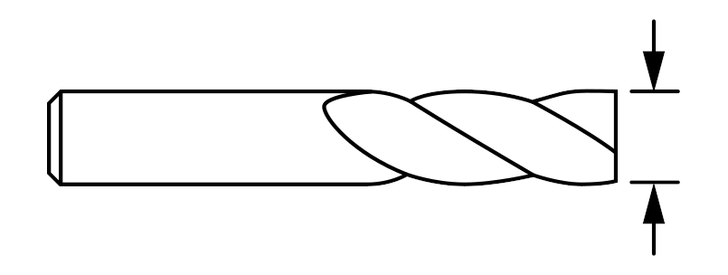{width=60%}

### Flutes
The grooves or cutting edges that remove material and carry chips away.

Why it matters:
Flute count affects chip evacuation, finish, and feed behavior.

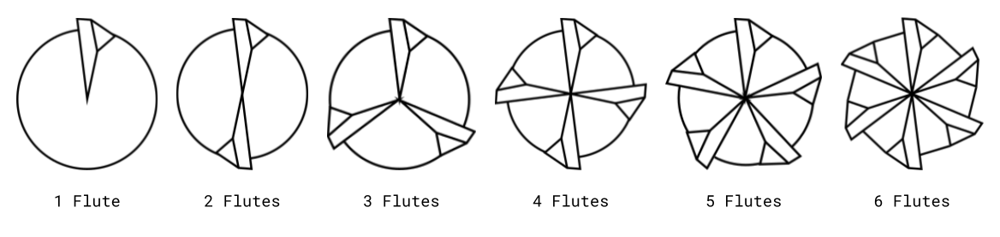{width=60%}

### Stickout
How far the tool extends from the holder or collet.

Why it matters:
More stickout means less rigidity. Use only as much stickout as needed to reach the feature safely.

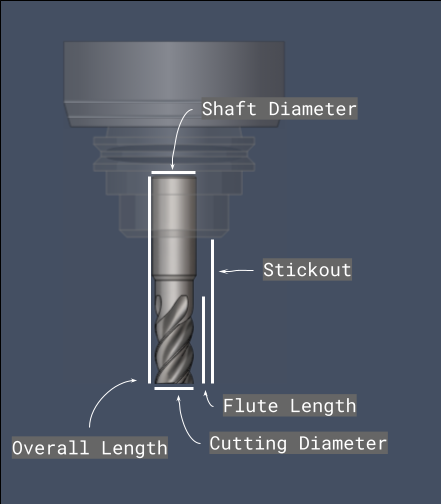{width=60%}

### Stepdown
How deep the tool cuts in one pass.

Why it matters:
Too much stepdown increases load, deflection, and chatter.

### Stepover
How far the tool moves sideways between adjacent passes.

Why it matters:
Stepover affects cycle time, finish, and cutter engagement.

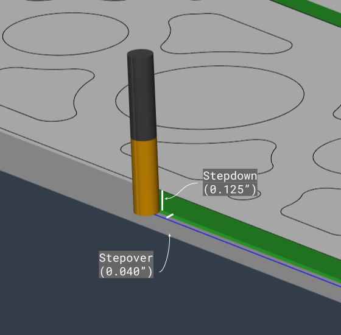{width=60%}

### Chip Load
The amount of material each cutting edge removes each time it passes through the cut.

Why it matters:
Chip load helps show whether the tool is cutting cleanly, rubbing, or overloaded.

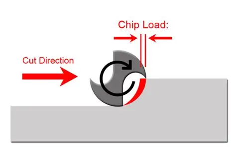

### Toolpath
The programmed path the cutter follows.

Why it matters:
Different toolpaths are used for different goals such as roughing, finishing, drilling, surfacing, or contouring.

## Useful Formulas
These are the basic formulas that come up all the time when setting feeds and speeds or converting units.

### Feed Rate From Chip Load
If chip load, spindle speed, and flute count are known:

`Feed rate = Chip load x Number of flutes x RPM`

Imperial example:

- Chip load = `0.002 in/tooth`
- Flutes = `2`
- RPM = `18000`
- Feed rate = `0.002 x 2 x 18000 = 72 IPM`

Metric example:

- Chip load = `0.05 mm/tooth`
- Flutes = `2`
- RPM = `18000`
- Feed rate = `0.05 x 2 x 18000 = 1800 mm/min`

Why it matters:
This is one of the most common CNC formulas. If the feed rate is too low for the RPM, the tool may rub instead of cutting. If it is too high, the tool may overload.

### Chip Load From Feed Rate
If feed rate, flute count, and spindle speed are known:

`Chip load = Feed rate / (Number of flutes x RPM)`

Imperial example:

- Feed rate = `60 IPM`
- Flutes = `2`
- RPM = `18000`
- Chip load = `60 / (2 x 18000) = 0.00167 in/tooth`

Metric example:

- Feed rate = `1500 mm/min`
- Flutes = `2`
- RPM = `18000`
- Chip load = `1500 / (2 x 18000) = 0.0417 mm/tooth`

Why it matters:
This is useful when a working feed rate already exists and the goal is to check whether the chip load still makes sense for the cutter and material.

### Feed Per Tooth
`Feed per tooth` and `chip load` are often used to mean the same thing for milling.

`Feed per tooth = Feed rate / (Number of flutes x RPM)`

Why it matters:
If a tooling chart gives feed per tooth, it can be used directly as chip load in the feed rate formula above.

### RPM From Feed Rate And Chip Load
If the target feed rate and chip load are known:

`RPM = Feed rate / (Chip load x Number of flutes)`

Why it matters:
This is handy when the machine or operation needs a certain feed rate and the correct spindle speed needs to be backed into from the target chip load.

### Surface Speed
Surface speed is how fast the outside of the cutter is moving relative to the material.

Imperial:

`SFM = (Tool diameter in inches x pi x RPM) / 12`

Metric:

`Surface speed in m/min = (Tool diameter in mm x pi x RPM) / 1000`

Why it matters:
Surface speed is another common way tooling manufacturers describe cutting conditions. It connects spindle speed to tool diameter.

### Unit Conversions
Common conversions:

- `1 in = 25.4 mm`
- `1 mm = 0.03937 in`
- `1 IPM = 25.4 mm/min`
- `1 mm/min = 0.03937 IPM`

For millimeters per second:

- `mm/s = (IPM x 25.4) / 60`
- `IPM = (mm/s x 60) / 25.4`

Example:

- `100 IPM = (100 x 25.4) / 60 = 42.33 mm/s`
- `50 mm/s = (50 x 60) / 25.4 = 118.11 IPM`

Why it matters:
Router feeds are often discussed in IPM, while some software, calculators, or motion settings may use `mm/min` or `mm/s`. Being able to convert quickly helps avoid unit mistakes.

### Material Removal Rate
For a simple milling estimate:

`MRR = Width of cut x Depth of cut x Feed rate`

Imperial result:

- If width and depth are in inches and feed is in `in/min`, MRR comes out in `in^3/min`

Metric result:

- If width and depth are in millimeters and feed is in `mm/min`, MRR comes out in `mm^3/min`

Why it matters:
MRR is a simple way to compare how aggressive one cut is compared to another. It is not the whole story, but it is useful for rough comparisons.

## End Mill Types
These are the tool types currently available and most relevant to the router and Tormach documentation.

### Flat End Mill
This is the most common cutter in the shop.

What it does:

- Cuts flat-bottom pockets
- Profiles walls and edges
- Clears material in 2D operations
- Bores holes

Why it matters:
This is usually the default cutter for router work and a very common cutter on the mill. Most examples in the shop docs will probably use a flat end mill unless there is a reason not to.

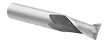

### Ball End Mill
A ball end mill has a rounded tip.

What it does:

- Cuts contoured 3D surfaces
- Leaves a smoother finish on curved geometry
- Works well for finishing shapes that are not flat-bottomed

Why it matters:
A ball end mill is usually chosen when the shape needs smooth 3D blending instead of a flat floor or a sharp corner at the bottom.

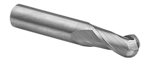
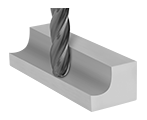

### Chamfer Mill
A chamfer mill is used to cut angled edges.

What it does:

- Breaks sharp edges
- Adds chamfers
- Can sometimes be used for deburring or engraving-like marking depending on geometry

Why it matters:
Chamfering improves safety, part feel, and edge finish, and it can help remove burrs left by previous operations.

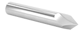
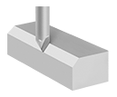

### Drill Bit
A drill bit is meant for drilling holes straight down into the material.

What it does:

- Creates holes quickly
- Starts holes for later tapping or boring
- Removes material axially rather than side cutting like an end mill

Why it matters:
A drill is usually the fastest way to create a hole when the hole size matches an available bit and the required accuracy is appropriate for drilling.

### Fly Cutter
A fly cutter is a tool used mainly for surfacing large flat areas.

What it does:

- Faces off the top of stock
- Trues flat surfaces
- Can leave a broad circular finish pattern

Why it matters:
A fly cutter is useful when a flat reference face is needed, especially on the mill. It is not the right choice for detailed pockets or side-wall profiling.

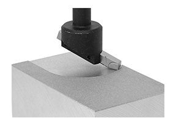

## Other Useful Terms

### Facing
Cutting the top of the stock flat.

### Roughing
Removing most of the unwanted material quickly.

### Finishing
Taking a lighter pass to improve size accuracy or surface finish.

### Pocket
Removing material inside a closed boundary.

### Contour
Following the outline of a part or wall.

### Bore
Interpolating a circular hole with a cutter.

### Adaptive
A roughing strategy that tries to keep cutter engagement more consistent.

### Deburr
Removing small sharp edges or leftover burrs after machining.