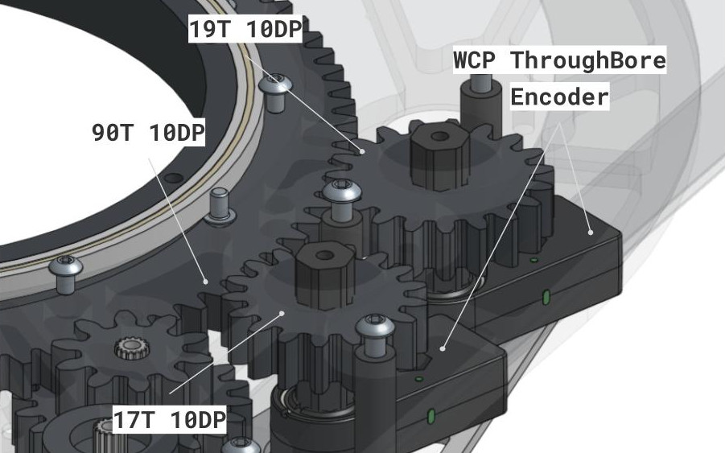

# Iterative Chinese Remainder Theorem for Absolute Turret Positioning

**Cyborg Cats, Team 4256**
04/23/2026
Authors: First lastinitial, etc

## 1. Abstract

This paper details the implementation of a Chinese Remainder Theorem (CRT) solver to achieve absolute positional awareness for an FRC mechanism (in our case, a turret). By using two encoders geared at different ratios, we create a system of congruences that allows the robot to determine the exact heading of the mechanism upon initialization without the need for homing sequences or limit switches. We specifically discuss an iterative "Search by Sieving" software implementation that provides error handling for sensor noise and gear backlash, the initialization architecture we built around it, and a modular-arithmetic defect we worked around during the season and diagnosed afterward.

## 2. Introduction

In FIRST robotics, turret initialization is a common bottleneck. Incremental encoders lose their position when power is cycled, requiring a dedicated "zeroing" procedure. Absolute encoders are a solution, but they are often limited to a 360° range. By applying the Chinese Remainder Theorem, we can combine two "small-range" sensors to create a single "large-range" virtual sensor that is absolute over the entire mechanical range of the mechanism.

### 2.1 Comparative Analysis

|  | Limit Switch / Homing Procedure | Single Absolute Encoder | Manual Homing | Dual-Encoder + CRT |
|---|---|---|---|---|
| **Strengths** | Simple to code; Cheap | No homing sequence; High reliability | Simple to code; Free | Absolute over multiple rotations; redundant data points; geared-up resolution |
| **Weaknesses** | Requires mechanical travel to "zero" | Limited to 360° with 1:1 gearing | Unreliable; Unrepeatable | Higher mechanical complexity |
| **Opportunities** | Good for simple linear mechanisms | Best for intakes or rotation-limited mechanisms | Good for mechanisms with a hardware limit | Ideal for high-travel mechanisms (turrets) |
| **Threats** | Sensor or mechanism damage during collision | Magnet slip, sensor wrap | Misalignment cannot be corrected after match start | Code failure if gear backlash exceeds tolerance |

## 3. Mathematical Theory

The Chinese Remainder Theorem states that if we know the remainder of an unknown value $x$ when divided by several moduli ($m_1, m_2, \ldots m_n$) we can uniquely determine $x$ up to the Least Common Multiple (LCM) of those moduli.

In our turret application, we define:

- $m_1, m_2$: The degrees of turret rotation per one full rotation of Encoders 1 and 2
- $r_1, r_2$: The current absolute position reported by the encoders, converted to **turret** degrees. Each encoder reports a normalized reading $a, b \in [0, 1)$ rotations, so $r_1 = a \cdot m_1$ and $r_2 = b \cdot m_2$.

We solve for $x$ in the following system:

$$x \equiv r_1 \pmod{m_1}$$
$$x \equiv r_2 \pmod{m_2}$$

## 4. Hardware Implementation

To ensure the math remains solvable over a wide range, the gear ratios for the two encoders must be chosen so that their teeth count are coprime. In our implementation:

- Turret Gear: 90 Teeth
- Encoder 1 Gear: 17 Teeth
- Encoder 2 Gear: 19 Teeth



### 4.1 Derived Constants

Every magic number in the solver comes from the three tooth counts. Let $T$ be the turret gear tooth count and $t_1, t_2$ the encoder pinion tooth counts.

| Quantity | Formula | Our values |
|---|---|---|
| Encoder 1 window | $360 \cdot t_1 / T$ | $m_1 = 68.0°$ |
| Encoder 2 window | $360 \cdot t_2 / T$ | $m_2 = 76.0°$ |
| Unique range | $360 \cdot t_1 t_2 / T$ | $1292°$, i.e. $\pm646°$ |
| Sieve iterations | $t_2$ (when coprime) | $19$ |
| False-candidate spacing | $\gcd(m_1, m_2) = 360 / T$ | $4.0°$ |
| Maximum safe tolerance | $180 / T$ | $2.0°$ |

The last two rows are important. Candidate solutions that satisfy encoder 1 but *not* the true position produce residuals spaced exactly one turret tooth pitch apart, or 4.0° for a 90T gear. A tolerance of half that spacing or more can select a wrong candidate and return an answer off by a multiple of $m_1 = 68°$. Anything at or above 2.0° is unsafe, regardless of how clean your sensors are.

### 4.2 Resolution Gain

Because encoder 1 is geared 90:17, one encoder count spans $68/N$ turret degrees rather than $360/N$. For any given encoder, the CRT arrangement delivers **5.3× the angular resolution** of the same sensor mounted 1:1. This is a second, independent reason to prefer the dual-encoder approach over a single absolute encoder, separate from the multi-rotation range.

### 4.3 Encoder Zeroing

The method assumes both encoders read known values at a known turret heading. This is a one-time calibration, and there are two reasonable ways to handle it.

For quick testing, Phoenix Tuner's zeroing button is the fastest path. Park the turret at its mechanical center, overshooting zero and coming back to take up any mechanical backlash. Click zero on both encoders without moving the turret. Nothing changes in your code, which makes it convenient while you are still moving hardware around.

For competition, record the raw readings at that same center position and store them as constants in code.

No homing sequence is needed after this calibration. Encoder offsets need to be re-tuned every time an encoder is unbolted, a magnet slips, or a pinion is un-meshed from the turret gear.

## 5. Software Implementation

While pure CRT is often solved using the Extended Euclidean Algorithm, our implementation uses an Iterative Search (sieving) method. This is computationally efficient for the limited ranges of FRC mechanisms and allows for a "tolerance" constant to account for encoder noise and mechanical backlash.

### 5.1 Logic Flow

1. Calculate the window of turret angles each encoder covers, relative to the turret ($m$).
2. Start with the first possible position indicated by Sensor A ($r_1$).
3. Incrementally add the full period of Sensor A ($m_1$). This ensures the first congruence remains true.
4. After each jump, check if the new position matches the remainder required by Sensor B ($r_2$) within a specific tolerance.

### 5.2 Python Implementation (Testing math off-robot)

While testing math off-robot, we used a simple python script to calculate a turret angle from two encoder values and tolerance.


```python

```

### 5.3 Java Implementation (Robot Code)

The following is the solver exactly as it ran on our competition robot. It contains the defect described in section 5.6; we have left it unmodified so the rest of this paper describes the system we actually competed with. See section 5.7 for the corrected version.

```java
public static double
solveCRT(
  double a, double b,
  double tolerance)
  {
    // Constants for gear ratio calculations
    double e1ToothCount = 17;
    double e2ToothCount = 19;
    double turretToothCount = 90.0;

    // Calculate the window of angles each encoder covers
    double m1 = 360.0 * (e1ToothCount / turretToothCount);
    double m2 = 360.0 * (e2ToothCount / turretToothCount);

    // Convert sensor readings to turret degrees
    double r1 = a * m1;
    double r2 = b * m2;

    // Search for a position that satisfies both sensor readings
    // e2ToothCount must be the larger of the two encoder gears

    for (int i = 0; i < 19; ++i) {
      double angle = r1 + (i * m1);

      // Check if this angle satisfies the second sensor's modulus
      if (Math.abs((angle % m2) - r2) < tolerance) {

        // Check if the turret has moved in the negative direction past zero
        // 1292 is the LCM of m1 and m2, and represents the total number of degrees CRT can cover
        if (angle >= 646.0) {
          angle -= 1292;
        }
        return angle;
      }
    }

    return Double.NaN;  // Return NaN if no valid position found
  }
```

### 5.4 System Integration

The CRT solver does not run continuously. We call it once during robot initialization and use the result to set the turret motor's integrated relative encoder. From that point forward, all closed-loop control reads the motor encoder, which counts angle incrementally for the remainder of the power cycle.

```
boot ──> read both absolute encoders ──> solveCRT() ──> seed motor encoder ──> closed-loop control
```

This architecture has consequences worth understanding before integrating it:

- **The absolute encoders only have to be right once.** A transient bad read at t = 0 is the only failure that matters; noise during a match is irrelevant because nothing reads them again.
- **A bad seed is silent and permanent.** There is no second opinion later in the match. If the solver returns an angle off by 68°, every shot for the rest of that match is aimed 68° wrong, and nothing in the code will notice. This is the single biggest argument for keeping tolerance well under the 2.0° ceiling from 4.1. This could potentially be mitigated by re-calculating during the match, or taking multiple samples per encoder and calculating using the median value.
- **It let us work around the defect in 5.6** by controlling the turret's position at boot, which would not have been possible if the solver ran every loop.

### 5.5 Advantages of Iteration

- **Backlash Compensation:** by using `Math.abs((angle % m2) - r2) < tolerance`, the code ignores slight mechanical misalignments that would break a traditional modulo operation.
- **Readability:** The logic is easier to debug than complex modular inverse math.
- **Fault detection:** The loop exhausts after $t_2$ iterations and returns `NaN` rather than a wrong answer when the two sensors disagree irreconcilably. (We originally described this as a "watchdog" against hanging, but a bounded `for` loop was never going to hang. The real value is that it fails loudly.)

### 5.6 Known Restrictions and Troubleshooting

While the CRT method is mathematically sound and repeatable with test values, we identified several real-world restrictions during testing:

**Tolerance Value.** If `tolerance` is too low, the code will return `NaN` due to gear backlash or encoder noise. If it is too high, the code may return a "false positive," meaning an incorrect angle off by a multiple of 68° that happens to fall within the margin of error. The upper bound is not arbitrary: it is $180/T = 2.0°$ for our 90T turret gear (see 4.1). We ran 0.1–0.5, which sits comfortably below that ceiling.

**Coprime Requirement.** The tooth counts of the encoder gears must be coprime. If they share a common factor, the unique range of the system drops by that factor, potentially leading to aliasing where two different turret positions look identical to the sensors.

**Backlash Accumulation.** This system assumes that the relationship between Sensor A and Sensor B remains constant. Significant slop in the gears between the two encoders can cause the congruences to drift. Mounting both encoders as close to the final turret gear as possible can minimize this.

**Modular Wrap Discontinuity.** This one cost us the most debugging time, and it is not a mechanical problem at all.

The expression `Math.abs((angle % m2) - r2)` compares two positions on a circle of circumference $m_2 = 76°$ using subtraction. That 76° is one full revolution of the 19T pinion, $360 \times 19/90$, so it is the interval at which encoder 2 rolls over from 0.999 back to 0.000. When one value sits just below 76 and the other just above 0, they are physically adjacent but numerically as far apart as possible. An example at a true turret angle of 151.9° (just under $2 \times 76$):

```
clean:   r1 = 15.900,  r2 = 75.900
         candidate i=2 -> angle = 151.900,  angle % 76 = 75.900
         |75.900 - 75.900| = 0.0000                        -> ACCEPT

nudge encoder 2 by +0.0015 rotations (about half a degree of encoder shaft):
         b wraps 0.99868 -> 0.00018,  r2 = 0.014
         candidate i=2 -> angle % 76 = 75.900
         |75.900 - 0.014| = 75.886                         -> REJECT
```

The correct candidate is thrown out and the function returns `NaN`, even though the two sensors actually disagree by only 0.114° once you measure the short way around the circle.

Three properties made this hard to identify:

1. **It is periodic, not random.** It shows only near multiples of 76° of turret travel, at 17 specific positions inside the ±646° range, which shows no differently than improperly zeroed encoders.
2. **Tolerance tuning cannot fix it.** The computed error is ~76°, so you would need a tolerance above 74° to suppress it, which is unsafe.
3. **Only encoder 2 is affected.** If noise pushes encoder 1 across its own zero, `r1` jumps from ~67.9 to ~0.05, but the sieve loops every $i$, so the correct answer simply appears at $i+1$ instead of $i$ and comes out within a fraction of a degree. The failure is self-healing on encoder 1 and fatal on encoder 2, because encoder 2 is the only one involved in a raw subtraction. This asymmetry is why swapping or re-seating sensors never reproduced a consistent pattern.

Off-robot simulation across the full ±646° range at 0.25° steps, with uniformly distributed noise injected into both encoder readings:

| Injected encoder noise | `NaN` from wrap discontinuity | `NaN` from noise exceeding tolerance |
|---|---|---|
| 0.1% rotation | 8 | 0 |
| 0.5% rotation | 14 | 0 |
| 1.0% rotation | 29 | 482 |

At realistic noise levels for a healthy mechanism, **every** failure is the wrap discontinuity. The mechanical explanations we pursued first only become dominant at noise levels well above what our hardware produces.

### 5.7 In-Season Mitigation and Post-Season Fixes

**What we did during the season.** Due to time constraints and necessity of tuning, once we identified that failures appeared to occur within ~90° of zero, we constrained pre-match setup so the turret always started roughly within the middle of that range. Combined with the one-shot setup architecture in 5.4, this was sufficient, and the solver only ever ran with the turret in a controlled position. The motor encoder handled the full range of travel afterward. We competed the season this way without a seeding failure.

This is a workaround, not a fix:

- It constrains pre-match setup and depends on the team getting it right every time.
- Most importantly, **it forfeits the multi-rotation absolute range that motivated the second encoder in the first place.** A mechanism guaranteed to boot within 76° could be handled by a single absolute encoder on the 17T gear, which covers 68° unambiguously, or by a 1:1 encoder covering 360°. If you adopt the workaround permanently, you have paid for a dual-encoder system and are using a fraction of it.


**Fix: circular difference.** The discontinuity disappears if the comparison measures the shorter arc between the two angles instead of the straight-line difference. In `solveCRT`, find this line:

```java
if (Math.abs((angle % m2) - r2) < tolerance) {
```

and replace it with these three:

```java
double d = Math.abs((angle % m2) - r2);
d = Math.min(d, m2 - d);
if (d < tolerance) {
```

Nothing else in the function changes.

Why it works: `angle % m2` and `r2` are both positions on a circle 76° around, but subtraction treats them as points on a straight line. When one sits near 76 and the other near 0 it measures the long way around, reporting 75.9 and 0.1 as 75.8 apart when they are physically 0.2 apart. The expression `m2 - d` is that same gap measured the other direction, and `Math.min` keeps whichever is shorter. It is the same reason 11:59 and 12:01 are two minutes apart rather than twelve hours.

In simulation this eliminates every wrap-induced `NaN` at all noise levels, leaving only the legitimate rejections where noise genuinely exceeded tolerance. Maximum error and wrong-candidate counts are unchanged. It removes the need for the 76° restriction entirely.

## 6. Conclusion

The Iterative CRT Solver provides a robust, "set-and-forget" solution for mechanism positioning. Since implementing this system, our robot calculates its absolute turret alignment upon robot boot, significantly increasing our reliability.

Our practical takeaway for other teams is that this was hard and took time to get right. The math itself, CRT over two coprime gear ratios, is not complicated; it worked on the first try with test values. What actually cost us time was the real-world implementation: comparing angles on a circle with plain subtraction, and picking a tolerance without realizing the safe ceiling is derivable from the turret gear tooth count. Neither of those shows up when you test with a handful of hand-picked angles, and both look like a mechanical problem (backlash, a bad tooth, a loose mount, etc.) when you are looking at the robot instead of the code. It took real debugging time to figure out we were chasing arithmetic and noise, not hardware.

Once we understood the failure and worked around it, though, it held up. We ran the rest of the season on the one-time setup in 5.4 without a single seeding failure. The most useful debugging steps were building an off-robot Python simulation like in section 5.2, but we would have caught more bugs earlier by sweeping it across the whole range with injected noise instead of just checking a few known angles.


## 7. CRT Solver Sandbox

<iframe src="/releases/crt_turret_sim.html"
        style="width:100%; height:850px; border:1px solid #333; border-radius:10px;"
        loading="lazy"></iframe>

This tool was vibecoded by Claude Opus 5 and has not been thoroughly reviewed. Verify the math and behavior yourself before relying on it.